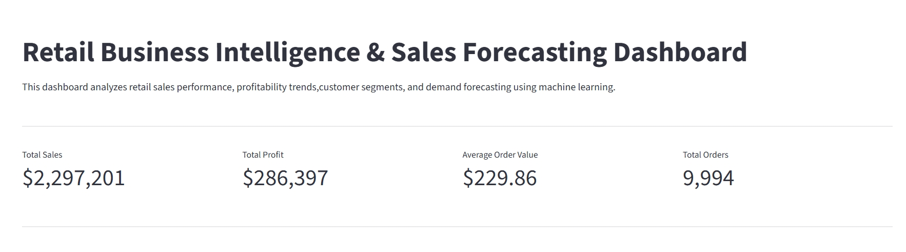
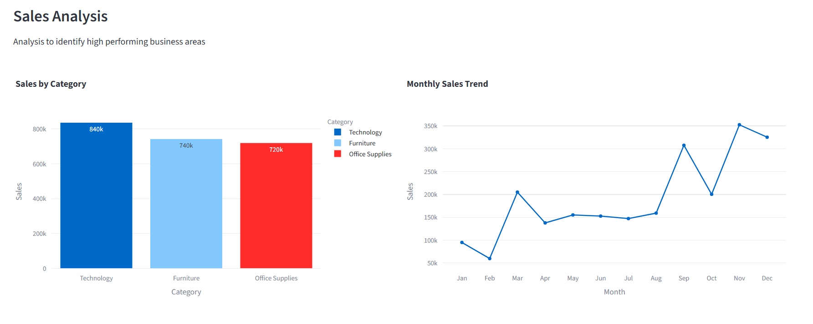
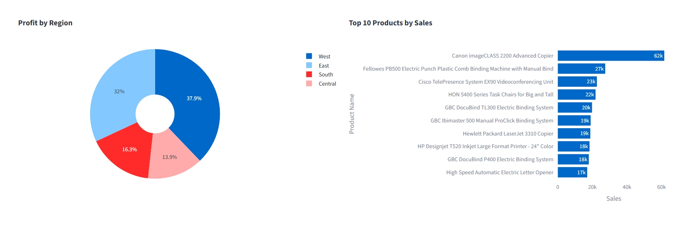
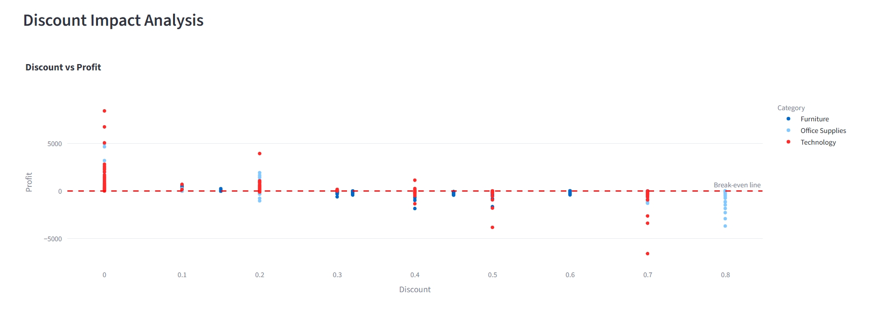
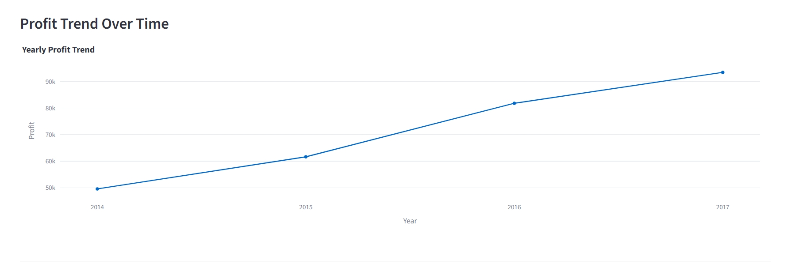
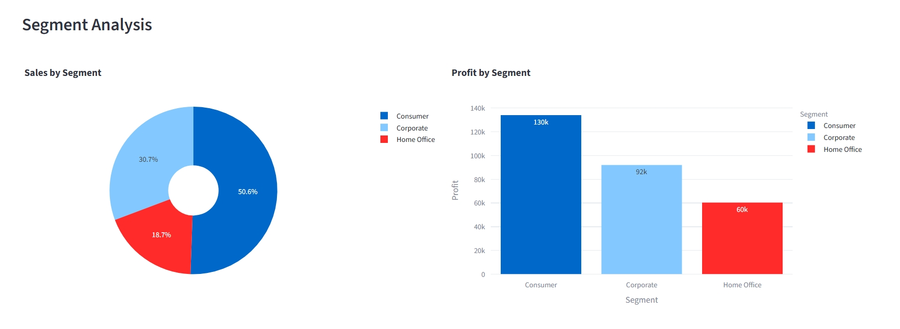
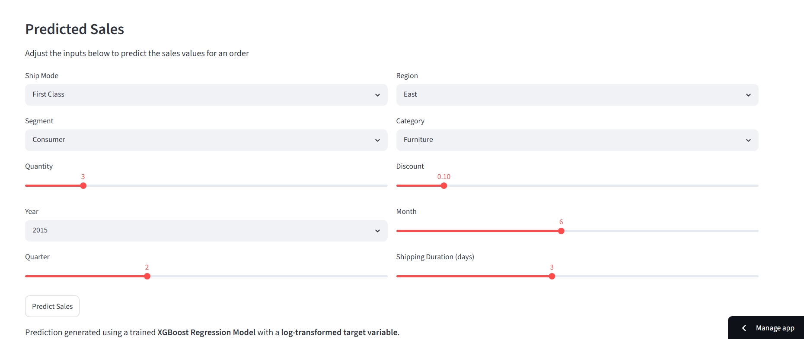
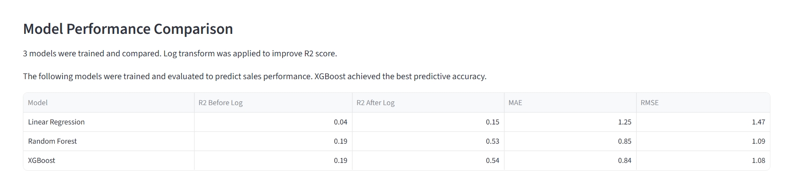
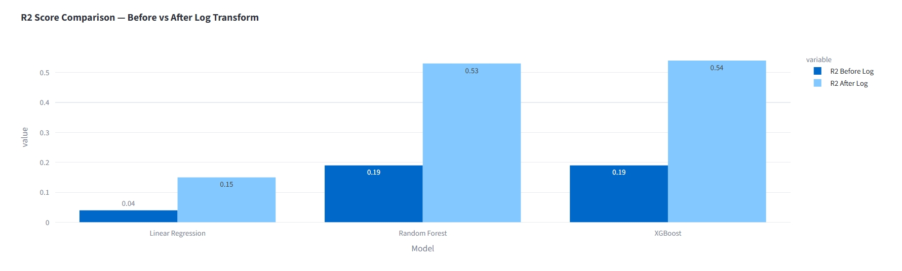
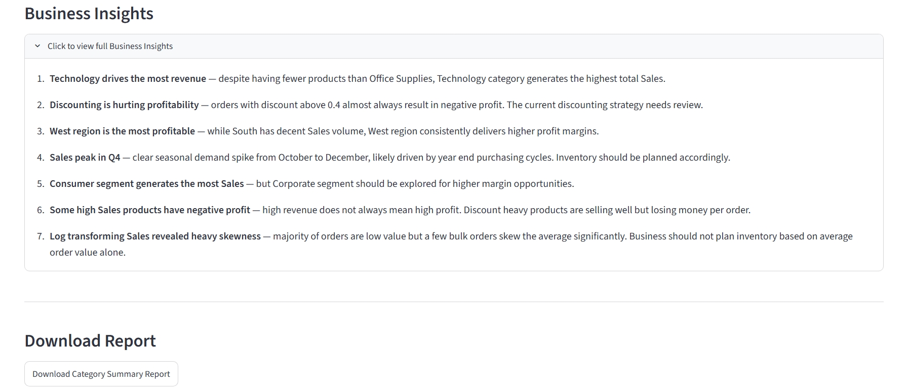

# Retail Business Intelligence & Sales Forecasting Dashboard

An end-to-end Data analytics, Business Intelligence and Machine Learning project built on the
Sample Superstore dataset. Covers data cleaning, exploratory data analysis,
machine learning model training, and an interactive Streamlit dashboard.

---

## Live Dashboard
[Open Dashboard](https://retail-sales-dashboard-4h7zdvbgsrjfenq7najf6s.streamlit.app/)

## Dashboard Preview

> Sales KPIs | Charts | Profit Trends | Segment Analysis | Sales Prediction | Model Comparison | Business Insights
The Interactive Dashboard provides business insights through visualizations and enables live sales prediction using a trained XGBoost regression model












---

## Project Structure

```
RETAIL-SALES-DASHBOARD/
│
├── data/
│   └── Sample - Superstore.csv
│
├── models/
│   └── best_model.pkl
│
├── notebooks/
│   └── analysis.ipynb
│
├── app.py
├── README.md
└── requirements.txt
```

---

## What This Project Does

- Loads and cleans 9,994 retail orders from the Superstore dataset
- Engineers new features like Shipping Duration, Year, Month and Quarter
- Performs exploratory data analysis to uncover business insights
- Trains and compares three machine learning models to predict Sales
- Deploys an interactive dashboard using Streamlit

---

## Key Findings

- Technology category generates the highest revenue despite fewer products
- Orders with discount above 0.4 almost always result in negative profit
- West region is the most profitable across all four regions
- Sales peak in Q4, indicating strong seasonal demand in year-end months
- Log transforming the Sales target improved model R2 from 0.19 to 0.54

---

## Machine Learning Results

| Model | R2 Before Log Transform | R2 After Log Transform | MAE | RMSE |
|---|---|---|---|---|
| Linear Regression | 0.04 | 0.15 | 1.25 | 1.47 |
| Random Forest | 0.19 | 0.53 | 0.85 | 1.09 |
| XGBoost | 0.19 | 0.54 | 0.84 | 1.08 |

XGBoost was selected as the final model based on best R2 score and lowest MAE.

## Why log transform was used
The target variable sales was higly right-skewed.
A logarithmic transformation was applied using
```python
np.log1p(Sales)
```
This improved the model stability, prediction accuracy and R^2 performance.

---

## Tech Stack
### Programming & Analytics
- Python
- Pandas
- NumPy
### Visualization
- Matplotlib
- Seaborn
- Plotly
### Machine Learning
- Scikit-learn
- XGBoost
### Deployment
- Streamlit
- Joblib

---

## Dashboard Features

- KPI cards — Total Sales, Total Profit, Average Order Value, Total Orders
- Sales by Category bar chart
- Monthly Sales Trend line chart
- Profit by Region donut chart
- Top 10 Products by Sales
- Discount vs Profit scatter plot with break-even line
- Yearly Profit Trend
- Segment Analysis — Sales and Profit by Segment
- Live Sales Prediction using trained XGBoost model
- Model Performance Comparison table and chart
- Business Insights
- Download Category Summary Report as CSV

---

## How to Run Locally

```bash
# Clone the repository
git clone https://github.com/yourusername/RETAIL-SALES-DASHBOARD.git

# Navigate to project folder
cd RETAIL-SALES-DASHBOARD

# Install dependencies
pip install -r requirements.txt

# Run the dashboard
streamlit run app.py
```

---

## Business Insights

1. Technology drives the most revenue — despite having fewer products than Office Supplies, Technology category generates the highest total Sales.
2. Discounting is hurting profitability — orders with discount above 0.4 almost always result in negative profit. The current discounting strategy needs review.
3. West region is the most profitable — while South has decent Sales volume, West region consistently delivers higher profit margins.
4. Sales peak in Q4 — clear seasonal demand spike from October to December, likely driven by year end purchasing cycles. Inventory should be planned accordingly.
5. Consumer segment generates the most Sales — but Corporate segment should be explored for higher margin opportunities.
6. Some high Sales products have negative profit — high revenue does not always mean high profit. Discount heavy products are selling well but losing money per order.
7. Log transforming Sales revealed heavy skewness — majority of orders are low value but a few bulk orders skew the average significantly. Business should not plan inventory based on average order value alone.

---
## Conclusion
This project demonstrates a complete end-to-end business analytics workflow, including:
- Data preprocessing
- Exploratory analysis
- Business insight generation
- Machine learning model development
- Interactive dashboard deployment
The project combines Business Intelligence and Machine Learning to support data-driven retail decision-making.